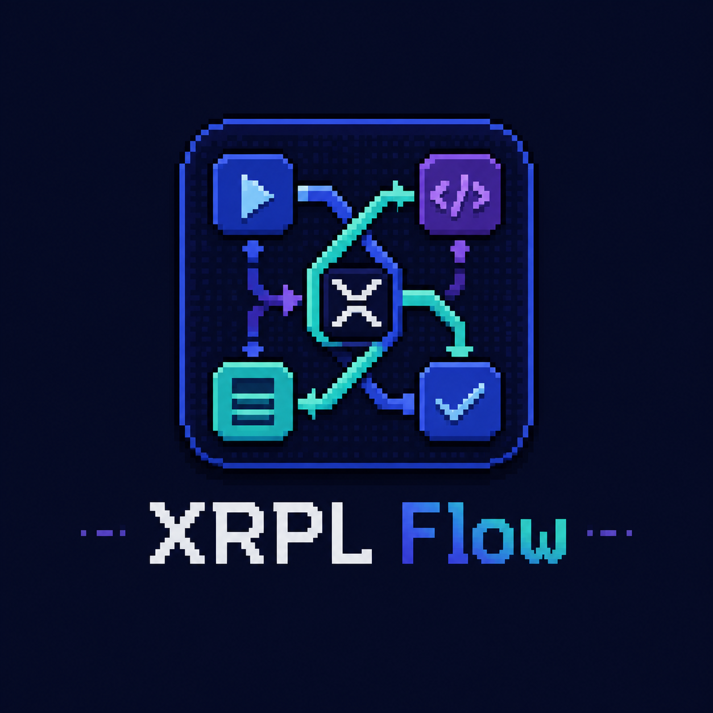

<p align="center">
  
</p>

<h1 align="center">XRPL Flow</h1>

<p align="center">
  <strong>A visual workflow builder for XRPL transactions.</strong>
</p>

<p align="center">
  <a href="https://github.com/Aaditya-T/XRPL-Flow/actions/workflows/ci.yml"></a>
  
</p>

XRPL Flow lets you build, inspect, and run XRPL workflows in the browser. It combines a node canvas, typed transaction adapters, wallet-aware execution, marketplace templates, and explicit Mainnet review prompts so complex ledger flows can be tested before they touch real funds.

## Highlights

- Visual workflow canvas for XRPL queries, utilities, branching, loops, containers, and transaction nodes.
- Transaction adapter registry generated from `xrpl` SDK expectations and validated before submission.
- Mainnet signing gate with per-transaction review after autofill and best-effort simulation.
- In-memory wallet handling: imported/generated seeds stay in the current tab and are cleared on refresh.
- Optional marketplace API on Cloudflare Pages Functions + D1.
- Optional BYOK AI workflow draft mode for trusted local/self-hosted use.

## Repository Layout

```text
artifacts/xrpl-flow/       React + Vite app, Cloudflare Pages config, Pages Functions API
artifacts/api-server/      Local Express API server and D1 schema/seed tooling
lib/api-client-react/      Generated API client
lib/api-spec/              OpenAPI source
lib/api-zod/               Generated Zod contracts
lib/db/                    Shared database schema
tests/                     Unit, API, Playwright, and opt-in live XRPL smoke tests
docs/testing.md            Testing policy and live-network setup
```

## Quick Start

Requirements:

- Node.js 20+
- pnpm 10.25.0+

```sh
pnpm install --frozen-lockfile
pnpm --filter @workspace/xrpl-flow dev
```

The app runs on Vite. Local `/api` requests proxy to `http://127.0.0.1:3001` by default. Start the local API in another terminal when you want marketplace endpoints:

```sh
pnpm --filter @workspace/api-server dev
```

## Quality Checks

```sh
pnpm typecheck
pnpm build
pnpm test
pnpm test:e2e
```

The default test suite is offline and deterministic. Live XRPL smoke tests are opt-in and require disposable funded testnet/devnet wallets:

```sh
XRPL_SMOKE_NETWORK=testnet \
XRPL_SMOKE_SEED=s... \
XRPL_SMOKE_DESTINATION=r... \
pnpm test:smoke:xrpl
```

See [docs/testing.md](./docs/testing.md) for fixture rules, Playwright debugging, and live-network setup.

## Cloudflare Deployment

The beta deployment target is Cloudflare Pages from `artifacts/xrpl-flow`.

```sh
pnpm --filter @workspace/xrpl-flow build
cd artifacts/xrpl-flow
wrangler pages deploy dist/public --project-name xrpl-flow
```

`artifacts/xrpl-flow/wrangler.toml` defines:

- Pages output: `dist/public`
- D1 binding: `DB`
- D1 database: `xrpl-flow-marketplace`

Apply the D1 schema before enabling marketplace writes:

```sh
pnpm --filter @workspace/api-server d1:schema:remote
```

Required Cloudflare secret for auth/session features:

```text
XRPL_FLOW_SESSION_SECRET
```

Optional Cloudflare variables/secrets:

```text
XAMAN_CLIENT_ID
XAMAN_CLIENT_SECRET
XAMAN_AUTHORIZE_URL
XAMAN_TOKEN_URL
XAMAN_USERINFO_URL
PUBLIC_API_BASE_URL
```

If Xaman OAuth is not configured, the app still builds and the public marketplace list can load, but sign-in and publishing are disabled.

## Safety Model

Generated and imported seeds are kept only in tab memory. They are never written to workflow documents or local storage, and they disappear on refresh. Do not import a valuable seed on an untrusted browser, extension profile, or device.

Mainnet execution is intentionally noisy. Each transaction is queued for review after autofill and best-effort simulation. The review includes network, account, signers, destination, amount, fee, flags, warnings, simulation result, and complete JSON. The reviewed payload is checked again before signing.

The AI workflow drawer is BYOK and browser-side. The OpenAI key is held only in a component reference for the current tab, but browser-side keys can still be observed by malicious extensions, injected scripts, and developer tooling. For a public hosted product, replace BYOK with server-side auth and secret storage before presenting it as a production AI feature.

## Transaction Coverage

The transaction palette is generated from `artifacts/xrpl-flow/src/lib/transactionAdapters.ts`. XRPL Flow covers payment, account, trust line, offer, escrow, check, payment channel, NFT, AMM, credential, oracle, DID, permissioned-domain, MPT, clawback, signer, ticket, deposit authorization, DelegateSet, Vault, Lending, and Batch families exposed by XRPL.js v5.

Intentional exclusions:

- XChain transactions
- `LedgerStateFix`

Devnet-only families:

- Vault
- Lending
- Batch

Batch containers require 2-8 non-Batch inner transactions and support all four Batch modes. Runs check that the connected Devnet server reports the required amendment.

## Workflow Documents

Imports and exports use `WorkflowDocumentV2`:

```ts
{
  version: 2;
  id: string;
  name: string;
  createdAt: number;
  updatedAt: number;
  nodes: WorkflowNode[];
  edges: Edge[];
}
```

v1 workflows are not migrated. Imports are validated for size, known node types, one trigger, duplicate or invalid edges, unreachable nodes, and graph cycles.

Condition and loop expressions use an allowlisted `jsep` grammar. They may read `output` properties and use literals, parentheses, comparison/equality, boolean operators, and unary `!`. Function calls, assignments, computed properties, constructors, and global access are rejected.

## Beta Readiness Checklist

Before making the repository public or announcing a hosted beta:

- Confirm `.env`, `.env.*`, `.dev.vars`, local wallets, API tokens, and funded test credentials are not tracked.
- Set `XRPL_FLOW_SESSION_SECRET` in Cloudflare before enabling Xaman sign-in or template publishing.
- Apply the D1 schema to the remote `xrpl-flow-marketplace` database.
- Run `pnpm test:ci` from a clean checkout.
- Run a Cloudflare Pages deploy dry run or preview deploy.
- Smoke test health, marketplace list, Xaman start/callback, template publish, and Mainnet review prompts on the deployed URL.

Pull-request CI runs `pnpm test:ci`: typecheck, build, offline Vitest tests, and mocked Playwright tests.
